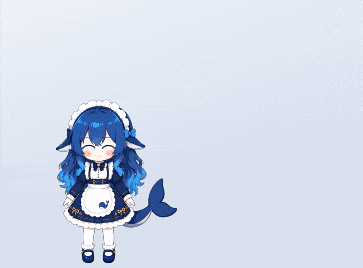
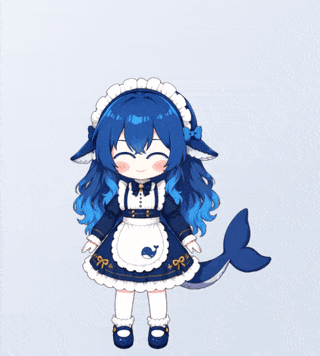
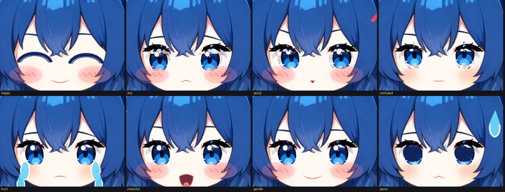
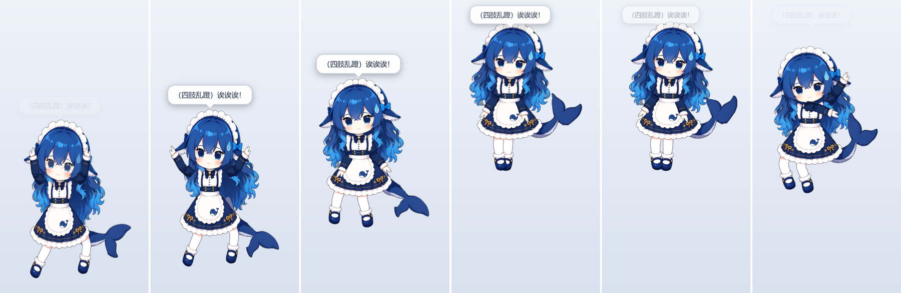

<h1 align="center">🐳 Whale-chan · 鲸鱼娘</h1>

<p align="center">
  <b>A desktop pet with a mind of her own.</b><br>
  She wants things, decides for herself, talks back in character, and you can pick her up and throw her.
</p>

<p align="center">
  English | <a href="README.zh-CN.md">简体中文</a>
</p>

<p align="center">
  <a href="https://github.com/jiaming1145/deepSeek-pet/actions/workflows/ci.yml"></a>
  <a href="LICENSE"></a>
  
  
  
  <a href="https://github.com/jiaming1145/deepSeek-pet/commits/main"></a>
</p>

<p align="center">
  
</p>

She is a drawing of a whale-girl maid, cut into layers and given a skeleton, living in a click-through
window on your desktop. Nothing about her is a video or a 3D model: her hair, tail and skirt are springs, her
face is made of swappable drawn pieces, and every move is code posing bones at 60 fps.

What makes her different from other desktop pets is **why** she moves. She does not roll dice for her next
animation. She carries four needs (rest, company, play, safety) that fill and drain as you interact with her or
leave her alone, scores everything she could do against them, and picks the best. Her mood is derived from those
same needs, so her face and her behaviour can never disagree. An optional [DeepSeek](https://www.deepseek.com/)
brain gives her a voice and a personality on top; she works completely without it.

## Try her

```bash
git clone https://github.com/jiaming1145/deepSeek-pet.git
cd deepSeek-pet
pnpm install
pnpm pet
```

Needs [Node 24+](https://nodejs.org/) and [pnpm 10](https://pnpm.io/installation) (`npm i -g pnpm@10`).
Windows 10/11 is where she is developed and verified; she is Electron and three.js, so macOS and Linux should
work but are untested (reports welcome).

**On a Mac**, start her with `pnpm pet:mac` instead of `pnpm pet`. It runs the same pet and adds what macOS
needs: no Dock icon (she lives in the menu-bar tray icon), Cmd+C / Cmd+V / Cmd+A / Cmd+Z in the chat box, and
she stays with you on every Space and over full-screen apps. It has not been verified on a real Mac yet.

| You | Her |
|---|---|
| Hover | She looks at the cursor, and turns around if you stay behind her |
| Click | A reaction that depends on where you touched her (head, tail, skirt...) |
| Double-click | Opens the chat box (so does the tray's Chat) |
| Drag | Picks her up. She startles, dangles, and panics if you shake her |
| Let go | She drops, or flies if you throw her, and lands with an opinion |
| Leave her alone | She wanders, sits, stretches, plays with her tail, naps when you are away |
| `Esc` | Closes the chat box. It never quits her |

Her window never takes the keyboard, so clicking, patting or dragging her leaves your typing where it was; only
the chat box borrows the keyboard, and only while it is open. The tray icon (bottom right of Windows) has Chat,
Wave, Nap, Autopilot, an out-of-character switch and Quit.

**Give her a brain (optional).** Get a key from [platform.deepseek.com](https://platform.deepseek.com/) and
either set `DEEPSEEK_API_KEY` in the environment or save it to `~/.ds/deepseek.key`. She then thinks about what
to do every 45 seconds or so, comments on things, and answers in the chat box. The key is read only by the
Electron main process and never reaches the page that renders her; without it she makes no network requests at
all. See [SECURITY.md](SECURITY.md) for exactly what is sent.

## What she does

- 🧠 **She wants things.** Four needs, a score for every activity, and a plain-language reason for every choice,
  kept in her log so her behaviour is explainable.
- 🤏 **You can pick her up.** Real hold, swing and throw physics with a startle, a dangling tail that curls when
  she is held high, distress when shaken, and a landing pose.
- 💬 **Talk to her and she acts it out.** Ask her to dance, come over, sit down or go to sleep; she replies in
  character with stage directions, and her body acts them out.
- 🎭 **18 moods on a drawn face.** Fourteen eye states, fourteen mouths, six brows and effects (blush, tears,
  sweat, hearts) combined from her own artwork, with blinks, gaze and visemes while she talks.
- 💃 **She dances a routine**, not an oscillation: six moves at 108 BPM with holds and accents.
- 🧡 **She remembers you.** When you first met, how long you have spent together, how often you petted or threw
  her, and how she felt when you closed her. Come back after a day and she has something to say about it.
- 🖥️ **Lives on the desktop, not in a window.** Click-through everywhere except within 14 px of her own pixels
  (per-pixel hit testing), so a click beside her reaches the app behind. Always on top, never takes your keyboard,
  walks along the taskbar edge, knows whether you are actually at the computer.
- 🔒 **Safe by construction.** No keyboard hooks, no clipboard, no screenshots; her own thoughts are
  rate-limited and every reply is validated, so a bad answer can never break her.

<p align="center">
  
</p>

<table align="center">
  <tr>
    <td align="center" width="30%"><br><sub>the routine, as she dances it</sub></td>
    <td align="center"><br><sub>eight of her eighteen moods</sub></td>
  </tr>
</table>

<p align="center">
  <br>
  <sub>picking her up: startle, hang, curl, panic when shaken, drop, land</sub>
</p>

## How she works

**From one drawing to a rig.** Her side view and her front view each went through
[See-through](https://github.com/shitagaki-lab/see-through), which separates a character drawing into layers
and paints in what was hidden (the far arm, the hair behind the head). A script derives a skeleton from the
layer shapes; nobody placed a bone by hand. At runtime each layer is glued to a bone, bendy parts (tail, hair,
skirt) are skinned across a chain with springs, and actions are small functions of time that pose the bones.
Locomotion uses the side view, facing you uses the front view, and she squashes between the two so it reads as
a turn rather than a cut. The runtime is plain [three.js](https://threejs.org/) in an
[Electron](https://www.electronjs.org/) window: no Live2D, no Spine.

**Her mind.** Everything she can do is scored against her needs:

| Need | Fills when | Drains when |
|---|---|---|
| rest | she naps (sitting only takes the edge off) | always, slowly; walking costs extra |
| company | you click her; a hover counts once, however long it lasts | always; your presence slows it |
| play | she wanders or plays with her tail | always, slowly |
| safety | quietly, over a minute | you drop or throw her |

Napping scores high when she is tired *and* you have been away from the keyboard, and is penalised if you were
just playing with her. Repeating herself is penalised so she never looks stuck. She commits to a choice for a
while instead of twitching. Her behaviour was tuned against a simulated hour (`media/mind_hour.png` shows
one), because every one of the four tuning traps found so far was invisible by eye and obvious on a chart.

**Her brain.** The language model runs only in the main process. Her own thoughts are one call per 45 seconds
at most (60 an hour), with a timeout, and must answer with the name of an activity she actually has; anything
else is discarded. A chat message is one call each, with the last eight turns as context. In the chat box the
model states her action on a separate machine-only line and writes her stage directions in brackets; what you
asked for, that line and those brackets are the only things that move her, so nothing she merely *says* in
prose can trigger an action. The out-of-character switch in the tray is a real switch, not a magic
string the model has to notice.

**Tested where it can be.** Her mind, voice, memory, performance reader and brain are plain Node modules with
no DOM or network, covered by `pnpm pet:test` in seconds (258 checks). Three Electron suites load the real page
off-screen: how she handles real use (orders, the chat box, which clicks the window takes), her animation
measured in window pixels (feet on the floor, no pops between moves), and a clock regression; run them from
`apps/desktop` with `npx electron ../../spikes/side_rig/pet_interaction.test.cjs` (and `anim.test.cjs`,
`mood_impulse.test.cjs`). Anything visual is proven with captures from the real renderer (`--capture`,
`--tour`, `--pet --selftest`), and the GIFs above were recorded the same way (`tools/media/`).

## Roadmap

- [x] Two-view cutout rig from her own drawings, springs, 20 actions, per-pixel hit testing
- [x] Needs-driven mind with explainable choices, memory across runs
- [x] Pick-up, throw and landing physics with a carry animation
- [x] DeepSeek persona, chat box, spoken lines that move her body
- [x] Dance routine, richer face (blinks, gaze, visemes, effects)
- [ ] Window-edge climbing and sitting on your windows
- [ ] English persona and voice as a first-class option
- [ ] Packaged installer (no Node required)
- [ ] macOS and Linux verified
- [ ] A second character through the same pipeline

## Contributing

Pull requests are welcome, and [CONTRIBUTING.md](CONTRIBUTING.md) explains where everything lives, how to run
the checks, and the two rules that have each cost a day. Good places to start: macOS/Linux testing, English
lines, new actions, packaging.

Found a bug? [Open an issue](https://github.com/jiaming1145/deepSeek-pet/issues/new/choose) with what she did.
Have a question or want to show what she did on your desktop?
[Discussions](https://github.com/jiaming1145/deepSeek-pet/discussions). Security concerns go through
[private reporting](https://github.com/jiaming1145/deepSeek-pet/security/advisories/new).

If she made you smile, a ⭐ helps other people find her.

## Also in this repository

`apps/desktop/` and `packages/` hold an earlier prototype: a Live2D avatar with a streamed DeepSeek chat, an
emotion-tagged dialogue band and a local SQLite history. It still builds and is covered by `pnpm test`, but the
pet above is where development happens. To run it: `git submodule update --init`, `pnpm fetch-sdk` (downloads
the Live2D Cubism SDK, about 21 MB), then `pnpm dev`.

## Credits and license

Code is [MIT](LICENSE). The character and her artwork belong to the author and are not covered by the code
license. Layer decomposition by [See-through](https://github.com/shitagaki-lab/see-through) (Apache-2.0).
The Live2D prototype uses sample data owned and copyrighted by Live2D Inc., used in accordance with their terms;
see [NOTICE](NOTICE) for every third-party component.

## Star history

<p align="center">
  <a href="https://star-history.com/#jiaming1145/deepSeek-pet&Date">
    <picture>
      <source media="(prefers-color-scheme: dark)" srcset="https://api.star-history.com/svg?repos=jiaming1145/deepSeek-pet&type=Date&theme=dark">
      
    </picture>
  </a>
</p>
